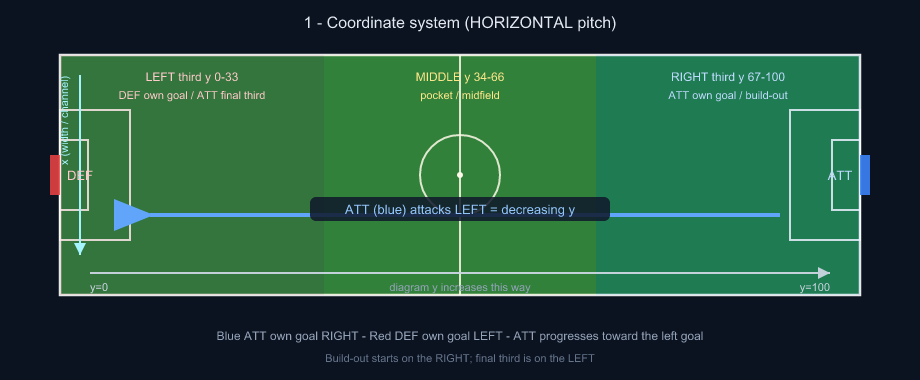
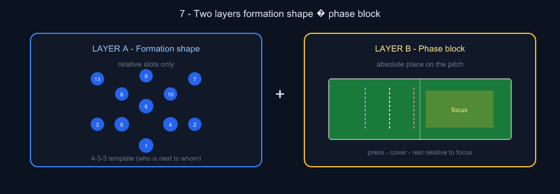
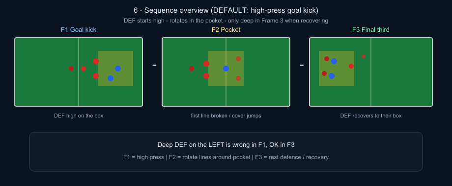
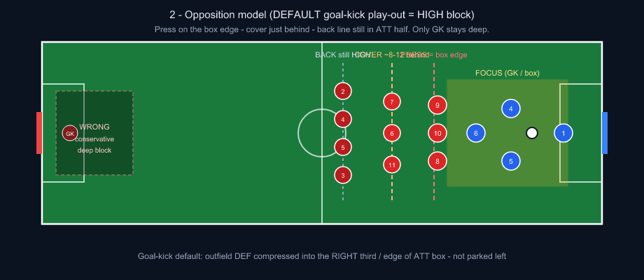
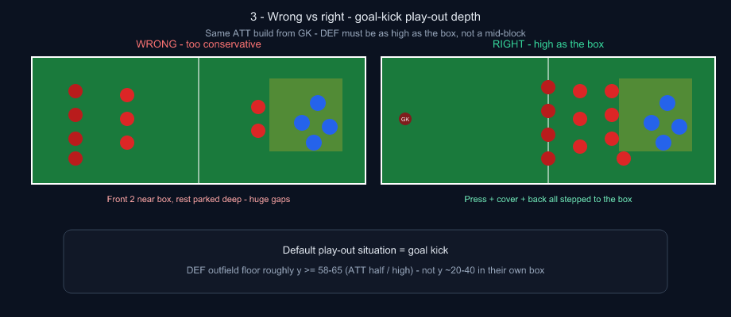
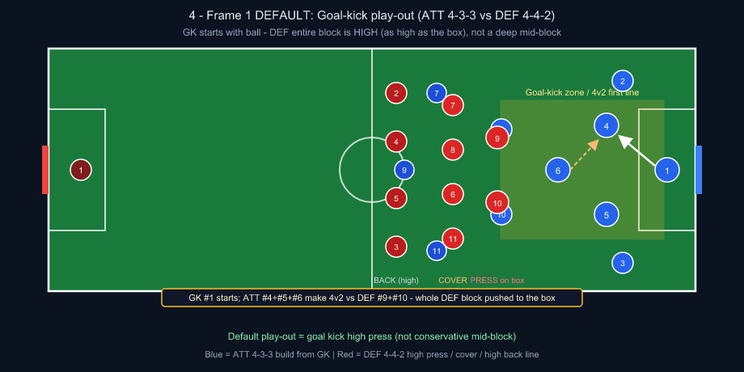
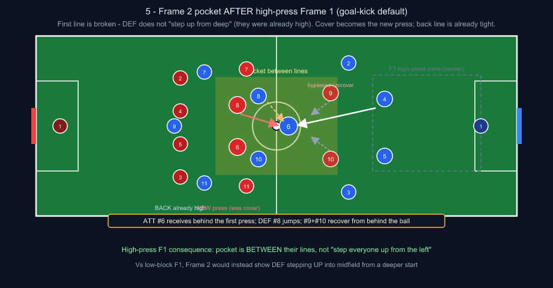
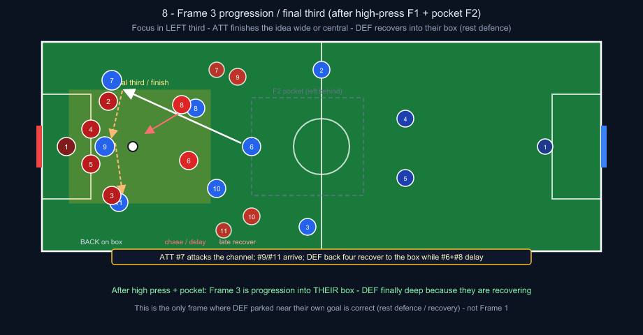

# Tactical Board — Phase Positioning & Opposition Model

Design contract for placing **both teams** on the board in every phase of play.  
Get this right once → implement for **all formations** (7v7 / 9v9 / 11v11) without per-shape special cases.

**Visual review pack:** PNG drawings in [`tactical-board/diagrams/`](./tactical-board/diagrams/) (SVGs kept as source). Best view: open [`tactical-board/review.html`](./tactical-board/review.html) in a browser.

Related code today:

- Formation slots: `apps/web/src/lib/board-formations.ts`
- AI prompt + opposition repair: `apps/api/src/services/board-ai-chat.ts`
- Phase placement (play-out F1–F3): `apps/api/src/services/board-phase-placement.ts`
- Sequence helpers: `apps/web/src/lib/board-sequence.ts`

**11v11 formation principles:**
- **v2 (authoritative):** [`docs/tactical-board/formation-principles-v2.md`](./tactical-board/formation-principles-v2.md) · [`formation-principles-v2.json`](./tactical-board/formation-principles-v2.json) · [`tactical-playbook-v2.pdf`](./tactical-board/tactical-playbook-v2.pdf)
- **Runtime (API):** `apps/api/src/data/formation-principles-v2.json` → `formation-principles.ts` (AI prompt) + `board-phase-placement.ts` (F1–F3 chassis)
- v1 summary: [`formation-principles.md`](./tactical-board/formation-principles.md)

---

## Visual index

| # | Drawing | Concept |
| --- | --- | --- |
| 1 | [Coordinates](./tactical-board/diagrams/01-coordinates.png) | Horizontal pitch, thirds, ATT/DEF goals |
| 2 | [Two layers](./tactical-board/diagrams/07-two-layers.png) | Formation shape × phase block |
| 3 | [Opposition lines](./tactical-board/diagrams/02-opposition-lines.png) | Press / cover / rest off the focus |
| 4 | [Wrong vs right](./tactical-board/diagrams/03-wrong-vs-right.png) | Formation dump vs focus-relative DEF |
| 5 | [Frame 1 build-up](./tactical-board/diagrams/04-frame1-buildup.png) | 4-3-3 vs 4-4-2 goal-kick high press |
| 6 | [Frame 2 pocket](./tactical-board/diagrams/05-frame2-pocket.png) | After high press — between their lines |
| 7 | [Frame 3 progression](./tactical-board/diagrams/08-frame3-progression.png) | Final third — DEF recovers to their box |
| 8 | [Sequence advance](./tactical-board/diagrams/06-sequence-advance.png) | Build → pocket → progress overview |

---

## 1. Board coordinate contract (never invent a vertical pitch)



Pitch is always **HORIZONTAL**.

| Axis | Meaning |
| --- | --- |
| **y** (0 → 100) | Goal → goal. `0` = **DEF** goal (left). `100` = **ATT** goal (right). |
| **x** (0 → 100) | Touchline → touchline (width / channel). |

Legend on the board:

- **Blue = ATT (us)** — own goal **RIGHT** (high y)
- **Red = DEF (them)** — own goal **LEFT** (low y)

**Attacking direction for ATT** = decreasing y (toward the left goal).  
**Build-up for ATT** starts near high y (own box / right third).

### Geographic thirds (along y)

| Third | y band | Coach language |
| --- | --- | --- |
| Left | ~0–33 | Their defensive third / our attacking third / final third |
| Middle | ~34–66 | Midfield / pocket / halfway |
| Right | ~67–100 | Our defensive third / their attacking third / build-out zone |

### Channel (along x)

| Channel | x band (approx) |
| --- | --- |
| Left | ~10–35 |
| Central | ~35–65 |
| Right | ~65–90 |

If the coach omits channel → **default central**.

---

## 2. Two layers: Formation Shape vs Phase Block



Every shirt has two jobs:

1. **Formation shape** — *who* they are relative to teammates (CB vs ST, #6 vs #9).  
2. **Phase block** — *where the unit sits* relative to the ball / focus on this slide.

```
final_position ≈ formation_slot (relative)
                 + phase_block_anchor (absolute on pitch)
                 + role_offset (press / cover / support / rest)
                 + channel_bias (left / central / right)
```

Formations only define **relative slots**.  
Phases define **where the block lives**.  
Opposition is always placed **relative to the live focus**, not parked in a frozen “away half” layout.

### Formation slots (already in code)

Each formation is a list of `{ number, role, x, depth }`:

- `x` = width across the pitch (0–100)
- `depth` = 0 near **own** goal → 1 high up the pitch

Mapping to board y:

- ATT (home): high depth → lower y (toward DEF goal)
- DEF (away): high depth → higher y (toward ATT goal) when they are pushed up; low depth stays near their own goal (low y)

**Key idea:** do not bake “DEF always lives in the left third.”  
Bake “DEF’s front line lives *N units in front of the ball* when pressing a build-up.”

---

## 3. The focus point (single source of truth)

Every slide has one **focus**:

1. Center of the main highlight area, else  
2. Ball position, else  
3. ATT outfield centroid

Everything else (press line, cover line, captions, denser arrows) hangs off this focus.

```
focus = { x, y }   // usually inside / on the yellow box
```

---

## 4. Phases of play (four moments)

Use the club’s four moments. Each maps to a **default focus third** and a **block posture**.

| Phase | Coach aliases | Default focus third | ATT posture | DEF posture |
| --- | --- | --- | --- | --- |
| **Attacking Organization** | in possession, build-up, play out, build from the back | Right (build) → Middle (progress) → Left (final third) | Structured possession shape around the ball | Compact block relative to ball (press / mid / low — see §5) |
| **Defensive Transition** | press after loss, counterpress, on the regain | Wherever the ball was lost | Immediate press around loss; rest defence behind | (roles flip momentarily — shirts keep ATT/DEF colors, jobs change) |
| **Defensive Organization** | out of possession, mid-block, low-block | Opposite to where ATT wants to progress | Compact block; deny lanes | Organized shape; distances between lines held |
| **Attacking Transition** | on the regain going forward, counter | Toward their goal (left) | Vertical runs, few touches | Recover toward own goal / delay |

For teaching sequences (play-out → pocket → progression), treat **Attacking Organization** as three **sub-phases** (frames):

| Frame | Name | Focus y (approx) | Teaching beat |
| --- | --- | --- | --- |
| 1 | Initial build-up | 72–90 | First line vs press; numerical advantage |
| 2 | Midfield / pocket | 45–65 | Break first line; third man; half-space |
| 3 | Progression / final third | 15–40 | Wide or central finish of the idea |



The play **must advance** (focus moves). Do not freeze Frame 2–3 on Frame 1’s box.

---

## 5. Opposition model (formation-agnostic)



When **ATT is on the ball** (build-up / pocket / progression), DEF is never “in their own half by default.”  
DEF is three **lines relative to focus**.

### Play-out situations (important)

“Play out” is not one picture. **Default = goal kick.**

| Situation | Ball start | DEF posture (default) |
| --- | --- | --- |
| **Goal kick (DEFAULT)** | GK in own box (focus y ≈ 85–95) | **High press as high as the box** — press on the box edge, cover just behind, back line still in ATT half. Only GK deep. |
| Open-play build from CB | Ball with CB / #6 higher | High / mid-high block relative to that focus |
| **Vs mid-block / low-block** | Same build, coach names the block | Deeper DEF is OK — respect the ask. Low-block: back line can sit nearer their own third. Mid-block: around halfway. |

**Rule:** bare “play out” / “build from the back” → goal-kick **high** block.  
If the coach says **mid-block** or **low-block**, use that depth instead — do not force the high press.

```
                    ATT goal (y=100)
                          │
                 GK / build focus ●
                          │
         ── DEF PRESS LINE ──   on the box edge (≈ focus.y − 6…10)
                          │
         ── DEF COVER LINE ──   ≈ focus.y − 14…18   (still ATT half)
                          │
         ── DEF BACK LINE ───   ≈ focus.y − 22…28, floor y ≥ ~58–65
                          │
                    DEF goal (y=0)  ← only GK lives here
```

### Line jobs

| Line | Who (by role, not formation id) | Job |
| --- | --- | --- |
| **Press** | Highest roles: ST(s), high AM/Wingers, nearest CM | Occupy the edge of the yellow box / duel the ball carrier |
| **Cover** | Remaining CMs / CDM / nearest CB stepping | Protect inside lane, cover shadow, jump second ball |
| **Rest / back** | Remaining CBs + fullbacks/wing-backs | Compact behind cover — **high**, not on their own box |

### Hard rules (what we kept getting wrong)



1. Caption saying “first press line / 4v2 / front two” ⇒ those shirts are **in or on** the highlight.  
2. **Goal-kick play-out (default)** ⇒ whole DEF outfield block is **as high as the ATT box** (press on edge; back line still ~halfway / ATT half, floor roughly **y ≥ 58–65**).  
3. GK is the only player allowed deep in their own box while the rest step up.  
4. Distance between DEF lines stays compact (~8–12 units). No 40-yard gaps between press and back four.  
5. Prefer **6–10 players involved** near focus on teaching slides (both colors).  
6. Mid-block / low-block only when the coach (or club model) asks for that press height.

### When DEF is on the ball / ATT is pressing

Mirror the model toward ATT’s goal:

- ATT press line at `focus.y + 8…12`
- ATT cover behind that
- ATT rest defence does not abandon the opposite side

---

## 6. How formation influences line membership

Formation only decides **who fills which line**, not where the block sits.

### Example — ATT 4-3-3 vs DEF 4-4-2 (DEFAULT goal-kick play-out, Frame 1)



Focus in right third (GK / goal-kick box). **DEF is high — not conservative.**

**ATT (build shape)** — relative slots compressed into our half:

| Role | Typical job on this slide |
| --- | --- |
| GK #1 | Starts with the ball (goal kick) |
| CB #4 / #5 | Split, available for first pass |
| FB #2 / #3 | High enough to pin wide mids / offer width |
| #6 | Drops between/ beside CBs or into pocket |
| #8 / #10 | Support angles above the first pass |
| #7 / #11 / #9 | Stretch or stay away so the 4v2 is clean |

**DEF (442 high press vs goal kick)** — same focus, opposition lines:

| Line | 442 shirts | Placement |
| --- | --- | --- |
| Press | #9 #10 (+ maybe #8/#7 jumping) | **On the edge of the ATT box** |
| Cover | #6 #8 + wide mids | ~8–12 behind press (still ATT half) |
| Rest | #2 #4 #5 #3 | High back line behind cover — **not** on their own box |

### Example — same formations, Frame 2 (pocket after HIGH press)



Because Frame 1 was already a **high press**, Frame 2 is **not** “pull DEF up from their own half.”  
They were already as high as the box — the story changes:

| Who | What happens in Frame 2 |
| --- | --- |
| Focus | Moves to middle third (pocket / half-space) |
| First press (#9/#10) | **Bypassed** — often end up *behind* the ball, recovering toward the pocket |
| Cover (#6/#8, wide mids) | Become the **new press** on the receiver |
| Back four | Already high — they **hold/compact** around the pocket (small shift), not a long step-up |
| Teaching beat | Break the first line; receive between lines; nearest mid jumps |

**Contrast — if Frame 1 had been low/mid-block:** Frame 2 would show the whole DEF block **traveling up** the pitch toward the new focus. After high press, travel distance is small; roles **rotate** (cover → press, press → recover).

```
F1 high press (RIGHT)          F2 pocket (MIDDLE)           F3 final third (LEFT)
┌─────────────────────┐        ┌─────────────────────┐      ┌─────────────────────┐
│  ATT box + GK       │        │                     │      │  ATT finish zone    │
│  DEF press on box   │  ──►   │  bypassed STs behind│ ──►  │  DEF back on box    │
│  cover + high back │        │  old cover = jump   │      │  chase / delay      │
│                     │        │  back already tight │      │  late recoverers    │
└─────────────────────┘        └─────────────────────┘      └─────────────────────┘
```

### Example — Frame 3 (progression / final third after HIGH press)



Frame 3 is where DEF **near their own goal is finally correct** — because they are **recovering**, not because they started deep.

| Who | What happens in Frame 3 |
| --- | --- |
| Focus | LEFT third (their box / final third) — wide channel or central cutback |
| ATT | Progress the ball (#6/#8/#10); winger (#7/#11) and #9 finish the idea |
| DEF back four | **Drop onto their box** — rest defence / recovery shape |
| Nearest mids (#6/#8) | Chase / delay the ball carrier |
| Old press (#9/#10) + wide | Late recovery — often still higher up, trailing the play |
| Teaching beat | Exploit the space behind a beaten high press; arrive numbers in the box |

**Key contrast with Frame 1:** deep DEF on the left in Frame 1 = wrong (conservative). Deep DEF on the left in Frame 3 = right (recovery after being broken).

### Example — ATT 4-3-3 vs DEF 3-5-2

Same phase block. Different line membership:

| Line | 352 shirts |
| --- | --- |
| Press | #9 #10 (front two) |
| Cover | #8 #6 #7 (mid three) + WB if jumping |
| Rest | #3 #5 #4 (back three); WBs can sit with mid or rest |

**No new phase math** — only role → line mapping changes.

---

## 7. What influences the picture (priority order)

When building or repairing a slide, resolve in this order:

1. **Phase (+ sub-phase / frame)** → focus third  
2. **Channel** → focus.x bias (central default)  
3. **Ball / highlight** → exact focus  
4. **Club play model** → which pattern to teach (e.g. Rocklin press triggers, build preferences)  
5. **ATT formation** → relative support shape around the ball  
6. **DEF formation** → who is press / cover / rest  
7. **Numerical story** → e.g. 4v2 first line, 3v2 pocket — must be visible in shirts inside the box  
8. **Coach / player language level** → caption density & vocabulary (not geometry)  
9. **Sequence continuity** → stable ids; move x/y; advance focus; don’t clone Frame 1 arrows/captions onto Frame 2

### Influences that must **not** win

- Raw “away formation dump” into the left third while the ball is on the right  
- Soft-anchoring later frames so hard that stepped-up DEF get yanked back deep  
- Single shared annotation layer across frames  

---

## 8. Sequence rules (multi-frame)

| Rule | Why |
| --- | --- |
| Stable player ids (`att-6`, `def-9`) | Tween / scrub |
| Full roster every frame | No disappearing structure |
| Independent arrows + labels per frame | Each beat teaches something new |
| Focus advances each frame | Build → pocket → progress |
| Frame 2+ denser than Frame 1 | 5–8 arrows, 2 captions, 6–10 shirts involved |
| Structure players drift slowly; active players freer | Readable morph, not teleport chaos |

---

## 9. Implementation blueprint (all formations)

Target architecture (what we should implement next):

### A. Role bands (shared)

```ts
type RoleBand = 'GK' | 'BACK' | 'MID' | 'FRONT';

function roleBand(role: string, number: number): RoleBand
```

Map every formation role → band. Formation files already have `role` strings.

### B. Phase block presets

```ts
type PhaseBlock = {
  focusThird: 'left' | 'middle' | 'right';
  focusY: number;          // or range
  attCompress: number;     // how tight ATT cluster around ball
  defPressOffsetY: number; // e.g. -10
  defCoverOffsetY: number; // e.g. -20
  defBackFloorY: number;   // hard minimum for outfield DEF
};
```

Table-drive the four phases + build-out sub-phases.

### C. Place team

```ts
placeTeam({
  side: 'ATT' | 'DEF',
  formationId,
  focus,
  channel,
  phaseBlock,
  onBall: boolean, // who has possession this slide
})
```

Steps:

1. Load formation slots.  
2. Anchor block so the unit’s “ball-side” depth aligns with phase.  
3. If this team is **out of possession**, overwrite front band → press line, mid band → cover, back band → rest floor.  
4. Apply channel bias to `x`.  
5. Separate overlaps (≥ ~5–7 units).

### D. Repair (safety net — already partially live)

Keep deterministic repair after the model draws:

- Orientation fix  
- Opposition press / cover / floor  
- Label parking outside highlights  
- Sequence coherence + Frame 2+ density  

Repair should encode **this document**, not ad-hoc constants only.

### E. Prompt

Prompt language should reference **phase block + opposition lines**, not “put red on the left.”  
Club model selects *which* pattern inside the phase (e.g. which trigger), not a different geometry system.

---

## 10. Worked checklist (QA for any formation pair)

For a play-out slide (Attacking Organization, Frame 1):

- [ ] Yellow box is in the **right** third (or stated channel)  
- [ ] ≥3 DEF outfield shirts within ~20 of focus  
- [ ] DEF press shirts match caption (“front two”, etc.)  
- [ ] No outfield DEF with y ≪ midfield while focus.y ≥ 70 — for **goal kick**, back line still high (roughly y ≥ 58–65)  
- [ ] Whole DEF block compact to the box (not only the front two)  
- [ ] ATT support angles visible (pass + drop / offer)  
- [ ] Caption is a full sentence with shirt numbers  

For Frame 2 (pocket after high press):

- [ ] Focus moved toward middle (not a copy of Frame 1 box)  
- [ ] Bypassed first press often behind the ball / recovering  
- [ ] Old cover becomes the new jump on the receiver  
- [ ] Back line already high — compact, not a long step-up from their box  
- [ ] New arrows + new captions (not Frame 1 clones)  
- [ ] 6–10 shirts involved  

For Frame 3 (final third after high press):

- [ ] Focus in LEFT third (their box / channel finish)  
- [ ] DEF back four **on their box** (recovery — OK here)  
- [ ] Nearest mids chase/delay; old press trails late  
- [ ] ATT finish actors (#7/#9/#11) in the picture with clear arrows  
- [ ] Caption narrates progression / arrive numbers — not Frame 1 language  

For any other formation pair: **same checklist** — only shirt numbers / role labels change.

---

## 11. Glossary (board meaning)

| Term | Meaning on this board |
| --- | --- |
| ATT / Blue | Us — goal on the right |
| DEF / Red | Them — goal on the left |
| Focus | Ball / highlight center — geometry anchor |
| Press line | First defending line nearest the ball |
| Cover line | Second defending line (protection / jump) |
| Rest / back | Deepest outfield defending line (still stepped up with the block) |
| Channel | Left / central / right lane of the idea |
| Phase | One of the four moments (+ build-out sub-frames) |
| Formation | Relative slot template only |

---

## 12. Next implementation steps

1. Codify `PhaseBlock` presets + `roleBand()` in a shared module (web + api).  
2. Replace “dump away formation on left” with `placeTeam(..., onBall=false)` using opposition lines.  
3. Drive AI prompt from the same presets (single source of truth).  
4. Keep repair as enforcement of §5 hard rules.  
5. Add a small fixture suite: `433vs442-playout-f1`, `433vs442-pocket-f2`, `433vs352-playout-f1` — assert DEF floor + press proximity.

When §5–§9 are implemented as data + placer (not only prompt text), every formation pair inherits correct opposition behavior automatically.
